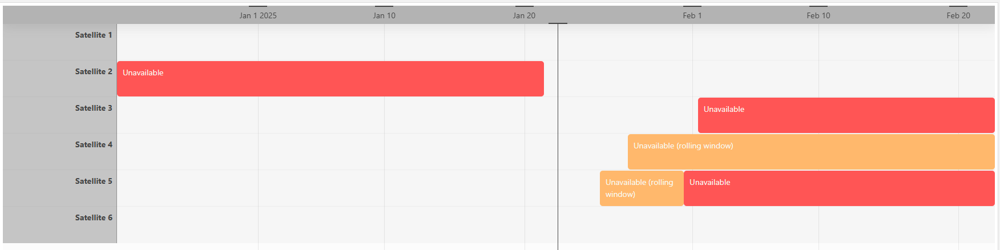
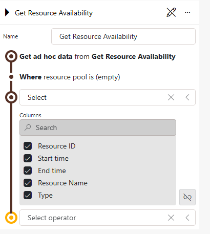

# Get Resource Availability

## About

With the Get Resource Availability data source, you will be able to retrieve information on the availability of the resources in your DataMiner System, so that you can display this in a DataMiner dashboard or low-code app.

## Key Features

- Show information on the availability of your resources on a timeline or in a table.

  

  

- Get live updates when resources are added, updated, or removed.

- Optionally filter your resources by pool. To improve performance, this is highly recommended in systems with a large number of resources.

## How to Use

1. Deploy this package to your DataMiner System.

1. [Create a new query](httpc://aka.dataminer.services/creating-a-gqi-query) in your dashboard or low-code app.

1. Select the data source "Get ad hoc data".

1. Select "Get Resource Availability".

1. Optionally fill in the ID of a resource pool, or link the value to a different component.

## Prerequisites

This ad hoc data source requires **DataMiner 10.5.3 or higher**. Make sure your DataMiner System has been upgraded to a compatible version before you try to use the data source.

## Technical Information

This ad hoc data source returns the time spans in which resources are unavailable based on their availability window (see [Resource availability](https://aka.dataminer.services/SRM-resource-availability)).

The data source will return the following columns:

| Column | Description |
|--|--|
| Resource ID | ID of the resource. |
| Start Time | Start time of the unavailability of the resource. |
| End Time | End time of the unavailability of the resource. |
| Resource Name | Name of the resource. |
| Type | Either "Fixed", if the start of this unavailability is not time-dependent, or "RollingWindow" if the start of the unavailability moves as a rolling window. |

Resources that do not have an availability window will also be returned, but the Start Time, End Time, and Type columns will be empty for such resources. This way, you can also display the resources without an availability window in a timeline component.

Resources will be loaded in a paged manner.

> [!IMPORTANT]
> If no pool filter is used, all resources in the system will be returned by the data source. This means that if you show the data from the query in a timeline component, the component will read all the pages before displaying anything. If your system has a large number of resources, this could cause performance issues.
